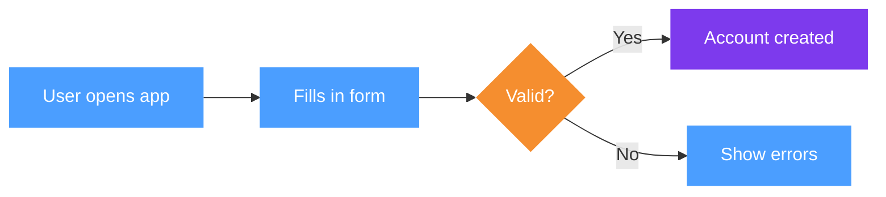

# FigJam Diagram Generator

You have two tools for creating FigJam diagrams. Choose the right one upfront — it determines the
entire approach.

## When to load
- User wants to visualise a process, flow, decision tree, or scenario
- Comparing multiple options/approaches side-by-side
- Turning meeting notes or a list of steps into a diagram
- Adding to an existing FigJam board (URL provided)
- **Editing / rearranging an existing populated board, or ingesting user-uploaded screenshots** → read `references/editing-existing-boards.md` FIRST

## Tool selection

| Signal in the request | Use |
|---|---|
| "add to this board / this FigJam", provides a Figma URL | **use_figma** |
| Wants sections with ADVANTAGES/SHORTCOMINGS, pros/cons | **use_figma** |
| Wants coloured flow (blue steps, purple system states) | **use_figma** |
| Comparing multiple options / scenarios side by side | **use_figma** |
| "quick flowchart", "simple diagram", no existing board | **generate_diagram** |
| Sequence diagram, state machine, Gantt chart | **generate_diagram** |
| Standard process flow, decision tree, no style requirements | **generate_diagram** |

When in doubt and no existing board is referenced → ask. If a Figma/FigJam URL is present → **use_figma**.

---

## MODE A — generate_diagram (Mermaid)

Use the `generate_diagram` tool from the Figma MCP server (commonly exposed as `mcp__claude_ai_Figma__generate_diagram` or similar — exact prefix depends on your MCP server registration).

**Supported types:** `flowchart`, `graph`, `sequenceDiagram`, `stateDiagram-v2`, `gantt`

**Mermaid rules enforced by the tool:**
- Direction: `LR` for flows (left-to-right) unless vertical makes more sense
- All node labels and edge labels **must** be in quotes: `["Text"]`, `-->|"Edge"|`
- No emojis, no `\n` for newlines inside labels
- Color styling only for flowchart/graph (not sequence/gantt), use sparingly
- No `end` as a className

**Color classes to apply when styling is wanted:**
```
classDef action fill:#4B9EFF,color:#fff,stroke:none
classDef system fill:#7D3AED,color:#fff,stroke:none
classDef decision fill:#F58E2F,color:#fff,stroke:none
classDef success fill:#26BA7A,color:#fff,stroke:none
```

**Example — styled process flow:**


Keep Mermaid diagrams **simple by default**. Add detail only if explicitly asked.

---

## MODE B — use_figma (Plugin API)

Use the `use_figma` tool from the Figma MCP server (commonly `mcp__claude_ai_Figma__use_figma` — exact prefix depends on your MCP server registration). Pass `fileKey` extracted from the FigJam URL.

> **Write contract:** if the official Figma plugin is installed, load **`/figma-use-figjam`** (+ `/figma-use`) before these `use_figma` calls — it's the canonical FigJam write contract. The rich helpers, styled-scenario patterns, and constraints below sit *on top* of it.

**URL patterns:**
- FigJam board: `https://www.figma.com/board/FILEKEY/...` → fileKey is `FILEKEY`
- Figma design: `https://www.figma.com/design/FILEKEY/...` → fileKey is `FILEKEY`

### ⚠ Critical FigJam Plugin API constraints

These functions **DO NOT EXIST** in FigJam. Calling them causes `TypeError: not a function` with no
line number — the hardest bug to diagnose:

```
❌ figma.createText()
❌ figma.createRectangle()
❌ figma.createEllipse()
❌ figma.createFrame()
❌ node.resizeWithoutConstraints()   ← use node.resize(w, h) instead
```

What you CAN use:

```
✅ figma.createSection()
✅ figma.createShapeWithText()       ← for BOTH coloured boxes AND plain text
✅ figma.createConnector()
✅ figma.createSticky()
✅ node.resize(w, h)
✅ figma.loadFontAsync({ family, style })
```

**ShapeWithText is universal.** Use it for:
- Coloured step boxes (SQUARE shape, solid fill)
- System state hexagons (HEXAGON shape, solid fill)
- Text annotations (SQUARE shape, empty fill + empty strokes = invisible background)
- Actor icons (ELLIPSE shape for head, SQUARE for body)

### ⚠ use_figma gives NO feedback

`console.log` inside `use_figma` returns nothing, and `use_figma` has no return value. You cannot
debug by logging or read values back through the call. To inspect state, re-fetch with `get_figjam`
(structure) or `get_screenshot` (pixels). Write code to be correct first, then verify. See
`references/editing-existing-boards.md` §2.

### Append before positioning

Always `parent.appendChild(node)` BEFORE setting `node.x` and `node.y`. Setting coordinates
before appending can silently fail or produce wrong positions.

```javascript
parent.appendChild(shape);
shape.x = rx;
shape.y = ry;
```

### Connector order

Append connector to section first, THEN set endpoints:
```javascript
const c = figma.createConnector();
parent.appendChild(c);
c.connectorStart = { endpointNodeId: a.id, magnet: "AUTO" };
c.connectorEnd   = { endpointNodeId: b.id, magnet: "AUTO" };
c.connectorEndStrokeCap   = "ARROW_LINES";
c.connectorStartStrokeCap = "NONE";
```

---

### Native FigJam Table

`figma.createTable(rows, cols)` creates a real FigJam table — confirmed working.

**Fixed cell dimensions (cannot be changed):**
- Each cell: **192px wide × 64px tall**
- Total table size: `192 * cols` × `64 * rows` — no resize possible

**⚠ TableNode has NO `resize()` method.** Calling `table.resize(...)` causes `TypeError: not a function`. Do not attempt to resize tables.

**Usage pattern:**
```javascript
// Load Inter Medium (default table font) BEFORE setting any cell text
await figma.loadFontAsync({ family: "Inter", style: "Medium" });
await figma.loadFontAsync({ family: "Inter", style: "Bold" });   // for headers

const t = figma.createTable(rows, cols);
parent.appendChild(t);
t.x = rx;
t.y = ry;

for (let r = 0; r < rows; r++) {
  for (let c = 0; c < cols; c++) {
    const cell = t.cellAt(r, c);
    await figma.loadFontAsync(cell.text.fontName); // ensure font loaded
    cell.text.characters = "content";
    if (r === 0) {
      // Make header row bold
      cell.text.fontName = { family: "Inter", style: "Bold" };
    }
  }
}
```

**Cell text length rule:** keep all cell text ≤ 22 characters. Longer text wraps inside the 192px cell, making the row taller than 64px. Fixed-height content placed below the table then overlaps.

**Calculating table dimensions before placing follow-on content:**
```javascript
const TABLE_COL_W = 192;
const TABLE_ROW_H = 64;
const tableWidth  = cols * TABLE_COL_W;    // e.g. 3 cols → 576px
const tableHeight = rows * TABLE_ROW_H;    // e.g. 5 rows → 320px
const nextY = tableY + tableHeight + padding;
```

---

### Verified helper library

Helpers live in `references/helpers.js`. Read that file when you need them — copy verbatim at the top of every `use_figma` call. Do not modify signatures.

**API summary** (full code + comments in the reference file):

| Function | Purpose |
|---|---|
| `C` | Colour palette object (`blue`, `purple`, `orange`, `green`, `gray`, `ink`, `white`) |
| `mkSection(name, x, y)` | Create a Section. Set fills LAST, after `mkSectionAnchor` |
| `mkSectionAnchor(sec, padX, padY)` | Invisible spacer that forces section bounding box. Call before setting fills |
| `mkHeader(parent, title, subtitle)` | Title (Medium 24, bold) + subtitle (Small 16) |
| `mkBox(parent, label, rx, ry, shapeType, color)` | Coloured step shape (SQUARE/HEXAGON/DIAMOND/ELLIPSE/ROUNDED_RECTANGLE) |
| `mkText(parent, content, rx, ry, w, h, size, bold)` | Plain text in a transparent box. Use FigJam scale: 16/24/40/64/96 |
| `mkPros(parent, content, rx, ry, w, h)` | ADVANTAGES box, green border. `h = (lineCount × 22) + 20` |
| `mkCons(parent, content, rx, ry, w, h)` | SHORTCOMINGS box, red border. Same height formula |
| `mkArrow(parent, a, b)` | Connector with arrow head, `magnet: "AUTO"` |
| `mkActor(parent, label, x, y)` | **async** — native FigJam User shape, with shape-fallback |
| `mkFlow(parent, steps)` | Row of step boxes connected with arrows. Constants: `SY=195`, `GAP=408`, `FX=265` |

**Critical rules baked into the helpers:**
- Section fills MUST be set after `mkSectionAnchor` and adding all content
- `await mkActor(...)` — it's async
- Hexagons are 177px tall (others 88px) and offset -44px to stay centred


---

### Standard section anatomy

A scenario/option section follows this vertical layout (all Y values relative to section top):

| Element | Y | Notes |
|---|---|---|
| **Bold title** (`mkHeader` title) | 28 | **24px bold** (FigJam Medium), max width ~1400px |
| Subtitle (`mkHeader` subtitle) | 80 | **16px regular** (FigJam Small), 1–2 sentences |
| Actor placeholder (`mkActor`) | 195 | Left edge at x=**64** (aligned with title/subtitle) |
| Step boxes (`mkFlow`) | 195 | Starting at x=265, spaced 408px (`SY=195`) |
| Step annotations | 340 | **16px** (FigJam Small), below the step row |
| ADVANTAGES (`mkPros`) | 410 | Bottom-left, ~580px wide |
| SHORTCOMINGS (`mkCons`) | 410 | Bottom-right, ~700px wide, x=640+ |

**⚠ Background anti-pattern — never do this:**
```javascript
// ❌ WRONG — white shape as background is an anti-pattern
const bg = figma.createShapeWithText();
bg.shapeType = "ROUNDED_RECTANGLE";
bg.resize(w, h);
bg.fills = [{ type: "SOLID", color: C.white }];
parent.appendChild(bg);  // Do NOT do this

// ✅ CORRECT — Section IS the background
const s = mkSection("Name", x, y, w, h);  // fills set inside mkSection
```

**After generating**, replace the `mkActor` placeholder with a proper FigJam person shape from the Insert panel.

**Section width formula:**
```
width = FX + (stepCount - 1) * GAP + 176 + 200
      = 265 + (n-1)*408 + 176 + 200
```
For 5 steps: 265 + 4×408 + 376 = 3273px ≈ 3300px

**Section height:** sections auto-expand to fit content — no fixed height needed.
(For reference, a typical full scenario with header + steps + annotations + pros/cons spans ~620px.)

**Stacking multiple sections:**
```javascript
// Estimate y offset for the next section based on expected content height
const SEC_H_ESTIMATE = 620, SEC_GAP = 120;
const s1y = BASE_Y;
const s2y = s1y + SEC_H + SEC_GAP;
const s3y = s2y + SEC_H + SEC_GAP;
```

> ⚠ Sections lay out by absolute Y, not tree order. After ANY edit that adds, removes, or resizes
> content, re-flow every section from y=0 (see `references/editing-existing-boards.md` §1) — an
> auto-resize can shove a section into negative Y and silently reorder the board.

---

### Visual grammar

Use shape type and colour to communicate meaning at a glance:

| Shape | Colour | Meaning |
|---|---|---|
| SQUARE | Blue `C.blue` | Human action (user, admin does something) |
| HEXAGON | Purple `C.purple` | System state change (automated, no human involved) |
| DIAMOND | Orange `C.orange` | Decision / branching point |
| SQUARE | Green `C.green` | Success / end state |
| SQUARE | Orange `C.orange` | Warning / error state |
| ELLIPSE+SQUARE | Gray `C.gray` | Actor icon (person) |

---

### Text writing guidelines

**Step box labels (inside coloured boxes):**
- Max ~30 characters, 2 lines max
- Use concrete verbs: "Uploads file", "System sends email", "Admin reviews diff"
- Active voice: what is literally happening at this step
- Business language, not code: "System validates format" → "System checks for errors"

**ADVANTAGES / SHORTCOMINGS:**
- Format: `"ADVANTAGES:\n• Point 1\n• Point 2\n• Point 3"`
- 3–4 points each, one clear statement per bullet
- Write from the client's perspective: "What does this mean for us in practice?"
- Avoid: "Simple to implement" → Prefer: "Quick to build on our side"
- Avoid: "Doesn't scale" → Prefer: "Hard to maintain at scale — 100 resellers = 100 files"

**Annotations (notes below step row):**
- Use `⚠` prefix for warnings
- Keep to 1–2 lines
- Describe the implication, not the technical detail

**Naming sections & cross-references:**
- Name sections descriptively, never with letter codes ("A — Canon"). Letter codes read as internal
  shorthand and break when sections get reordered. Set both `node.name` (layer panel) and the visible
  header text. Don't reference sections by code in body copy ("see G", "F3") — name the thing.

---

### Workflow for use_figma diagrams

1. **Read input** — understand what process/options/system is being diagrammed
2. **Plan on paper first** (write it out before coding):
   - How many sections?
   - What is the **bold headline** for each section? (plain language, client-facing)
   - What is the **subtitle** (1–2 sentences explaining the mechanic)?
   - What are the steps? Which are human (SQUARE/blue) vs system (HEXAGON/purple)?
   - What annotations, advantages, shortcomings go where?
   - Are pros/cons 3 lines or 4? Calculate `h` before writing code.
3. **Write all code in one `use_figma` call** — multiple calls multiply the chance of errors
4. Always use `mkHeader()` for the title+subtitle — never bare `mkText` for descriptions
5. Always use `mkPros()` / `mkCons()` for advantages/shortcomings — never plain `mkText`
6. **End with** `figma.viewport.scrollAndZoomIntoView([s1, s2, ...])` so the user can see results
7. **Take a screenshot** of at least the first section to verify layout and check for text clipping
8. **Tell the user**: replace actor placeholders with FigJam library person shapes after generation

---

### Finding empty space on the board

Before placing new sections, find the existing content to avoid overlapping:

```javascript
// Find the bounding box of all existing content
const allNodes = figma.currentPage.children;
let maxY = 0;
for (const n of allNodes) {
  if (n.y + n.height > maxY) maxY = n.y + n.height;
}
const BASE_Y = maxY + 400; // place new content 400px below existing
```

Or use the `mcp__pencil__find_empty_space_on_canvas` tool if available.

---

### Full section template (copy and adapt)

```javascript
// Place this after the helper library above
const BASE_X = 26416; // match existing board x-coordinate, or use 0 for new board
const BASE_Y = 5700;  // below existing content — calculate dynamically (see above)

// Create section — fills are set LAST, after all content is added
const s1 = mkSection("Option 1: [Name]", BASE_X, BASE_Y);

// Header: bold title + subtitle
mkHeader(s1,
  "Plain-language headline for this option",
  "One or two sentences explaining what happens and why it matters to the reader.");

// Native FigJam User shape — no manual replacement needed
await mkActor(s1, "Admin", 64, SY);  // x=64 aligns with title/subtitle left edge (PAD_L)

const steps1 = mkFlow(s1, [
  { t: "First step label" },
  { t: "Second step label" },
  { t: "System does something", hex: true },
  { t: "Fourth step label" },
  { t: "Final step label" },
]);

// Annotation below step row — use FigJam Small (16px) for standalone text
// Y=340 sits just below the step boxes (SY=195 + height=88 + ~57px gap)
mkText(s1, "⚠ Warning or important note about this flow.", FX, 340, 900, 56, 16, false);

// Pros/cons — use mkPros/mkCons, NOT plain mkText, for the colored borders
// Y=410 sits ~70px below the annotation row — keeps section compact
// HEIGHT FORMULA: h = (lineCount × 22) + 20 — calculate before writing code
//   3 bullets → h = (4×22)+20 = 108  →  use 112
//   4 bullets → h = (5×22)+20 = 130  →  use 134
mkPros(s1,
  "ADVANTAGES:\n• Advantage one — explain the business impact\n• Advantage two\n• Advantage three",
  64, 410, 580, 112);
mkCons(s1,
  "SHORTCOMINGS:\n• Shortcoming one — concrete consequence\n• Shortcoming two\n• Shortcoming three\n• Shortcoming four",
  660, 410, 700, 134);

// ⚠ ALWAYS call mkSectionAnchor BEFORE setting fills.
// Without it, fills only cover the section's pre-script bounding box (often tiny).
mkSectionAnchor(s1, 80, 80);  // ← required step

// ⚠ Set white fill LAST — after anchor is in place
s1.fills = [{ type: "SOLID", color: C.white }];

figma.viewport.scrollAndZoomIntoView([s1]);
```

**⚠ After running the script:**
1. **Resize the section** — FigJam sections don't auto-expand programmatically. After the script runs, the section may appear smaller than its content. Drag the section border to fit all children. Aim for ~64px padding on all sides.
2. Take a screenshot to verify no text is clipped — if it is, re-run with a taller `h` on the offending `mkText`

---

## MODE C — Editing an existing populated board

When the board already has content (you're rearranging, translating, adding a section, or snapping in
user-uploaded screenshots), the rules differ from greenfield creation. **Read
`references/editing-existing-boards.md` before starting.** Key points:

- **Re-flow sections from y=0** after any add/remove/resize — layout is by absolute Y, not tree order.
- **No debugging via logs** — `use_figma` returns nothing; verify with `get_figjam` / `get_screenshot`.
- **`get_metadata` doesn't work on FigJam** — use `get_figjam` for structure.
- **Images: placeholder → swap** — the API can't upload rasters; build named placeholder frames, have
  the user drag PNGs in, then map images onto placeholders by name and delete the placeholders.
- **Re-parenting needs coordinate conversion** — after `appendChild`, convert absolute→section-relative
  via `absoluteTransform`.
- **Remove the stray upload container** left behind by drag-drop once images are placed.

---

## Reference files

- `references/plugin-api-guide.md` — complete confirmed API surface, all known gotchas, shape type list
- `references/visual-patterns.md` — detailed layout patterns for different diagram types (comparison grids, decision trees, user journeys)
- `references/editing-existing-boards.md` — editing/rearranging a populated board, re-flowing sections, ingesting user-uploaded images, the placeholder→swap pattern (lessons from real edit sessions)

Read them when the task is complex or requires a layout type not covered above.
